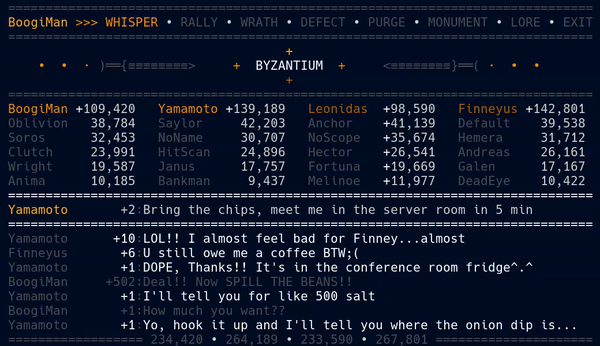
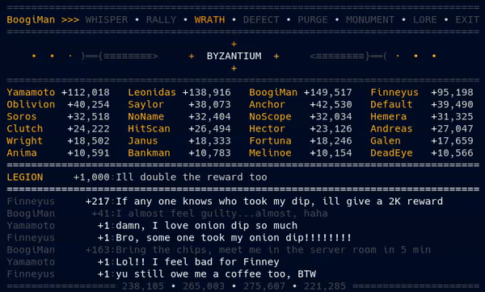
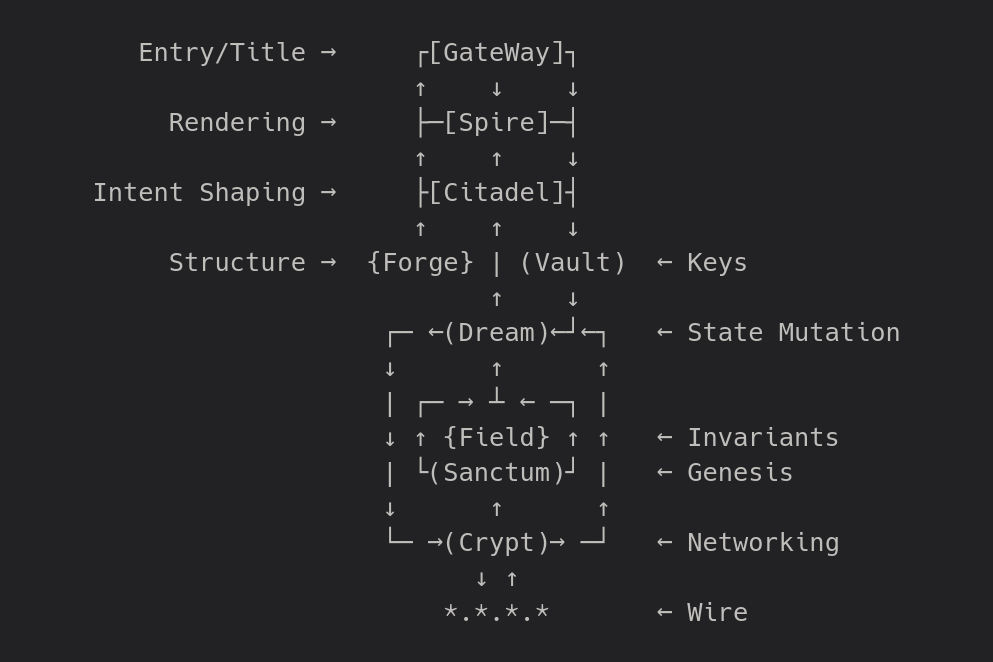
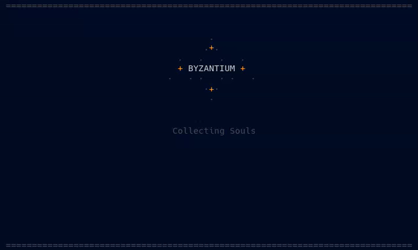

# ⚔️ Byzantium ⚔️

**A shared projection where actions become reality.**

---



---

## 🧠 What This Is

Byzantium is a **shared projection**.

The system exists entirely on the surface you’re looking at. There’s no hidden layer, no stored history, no backend keeping score. What you see is the system—continuously reshaped by the people inside it.

You don’t play *on* it. You play *with* it.

It’s like a group of people holding up a card table. As long as someone is still holding it, the table exists—and the game continues. Once everyone lets go, it disappears.

---

## 🐧 Operating System Support

- ✅ Linux  
- ✅ macOS  
- ❌ Windows (sorry, but not sorry)

---

## ⬇️ Install

To run Byzantium, install it with:

```bash
pipx install Byzantium-Game && Byzantium
```

You’ll need **Python 3.9 or newer** and an **80x24 UNIX-like terminal environment.**

> Don't have [`pipx`](../Relics/pipx.md)?

---

## 🌐 Networking

Byzantium runs in two modes.

**Siege Mode** is local—multiple terminals on the same machine. *(a controlled sandbox)*  
**Campaign Mode** runs across a LAN, allowing multiple machines to share the same projection.

>  *All nodes must use the same gateway (port),skeleton key, and number of souls to join the same projection. Default gateway: 9000*.  
>  *Tip: just spam Enter to drop straight into a board*.

---

## ♟️ The Board ♟️

At the center of Byzantium is a **24-cell board**.

Those 24 cells are the state.

Everything you see between the menu and the input line—the 6x4 grid—is the system itself. There is nothing behind it. The system doesn’t synchronize logs or events. It synchronizes this board.

When participants agree on those 24 cells, the result behaves like a single structure perceived from multiple places.

> You’re not looking at a representation of the system.  
> You’re looking at the system.

---



> ↑↑↑...Fun fact: *This GIF is over 5× the size of the entire Byzantium runtime*...↑↑↑

---

## 🔍 What You're Seeing

Messages aren’t logs—they’re part of state. Value (“salt”) moves through interaction, and incentives shape behavior in real time.

Every action attempts to reshape the board. If the change is valid, it becomes reality. If it isn’t, it disappears.

There are no forks. No reconciliation. No second chances.

> History is replaced by admissibility.

---

## 🔥 Ashfall (Text Feed)

The text feed isn’t a global log. Each node keeps a small rolling cache of recent messages—just enough to give context.

This means different participants may see slightly different recent text. The feed is local atmosphere, not shared truth.

> The feed drifts. The board converges.

---

## 🧩 Presence & Rejoining

You can leave at any time and come back later—seconds, minutes, or hours.

As long as at least one participant is still connected, the projection persists.

When you return with the same identity, nothing is replayed and nothing is reconstructed. You simply accept the current valid state—in a single step.

It’s like stepping back up to the card table. You don’t ask what happened while you were gone. You just look down—and the game is already in progress.

> You don’t reconnect to the past.  
> You reconnect to the present.

---

## ⚙️ How It Works (Brief)

Players (“souls”) enter a shared state. A deterministic genesis builds the board, and every interaction is expressed as a glyph—validated, applied, and propagated across the network.

Each part of the system only accepts what already exists or one valid next state. Anything else is ignored completely.

This allows the board to converge without logs, history, or replay.

> If it can’t exist next, it doesn’t exist at all.

---

## 🏛️ Architecture



> *The upper part of the stack runs on State, and the lower stack runs on Glyphs*

---

## 🔐 Security Notice

Byzantium uses Ed25519 signing to validate actions.

However, networking currently relies on simple XOR-based obfuscation. This is not secure encryption—and it’s not meant to be.

The system prioritizes **state integrity over transport security**.

---



---

## 🤔 What This Is Not

This is not a traditional system.

No history. No ordering. No replay.  
Consensus is not negotiated.

This is not a hardened protocol or a finished product.

---

## 🧬 Design

This is a game built on an **admissibility-governed state**.

The state resolves to what can exist, and **only what exists persists.**

---

## 🪶 A Note

If the Hydra demo was the one-minute flight, this is closer to the ten-minute flight.

It’s not smooth. It’s not comfortable.

But it flies.

---

## 📜 License

This project is released under the terms of the [`LICENSE`](../LICENSE).

Use it, study it, modify it—just respect the terms outlined there.
