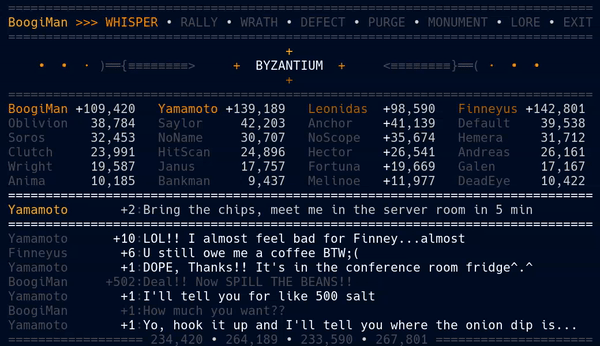
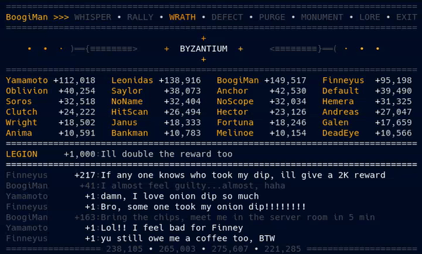
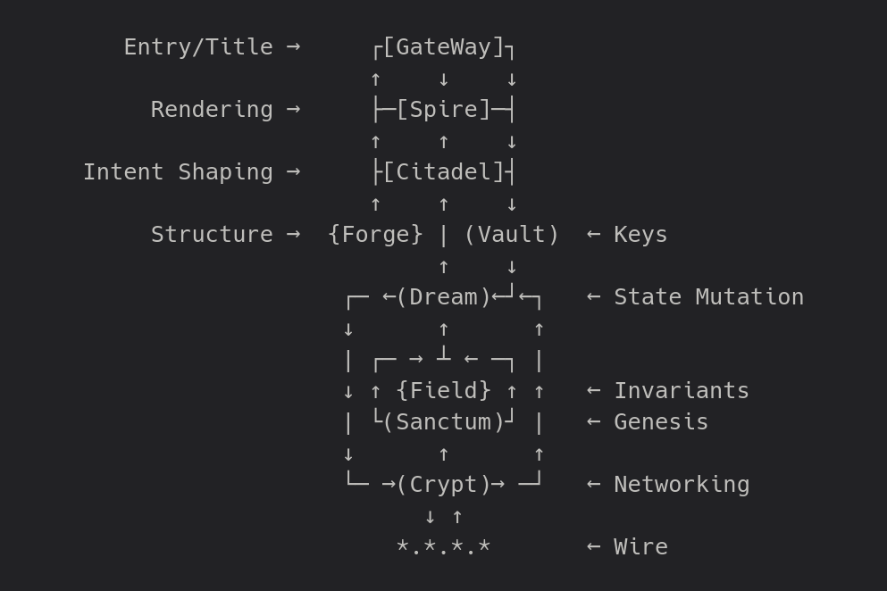
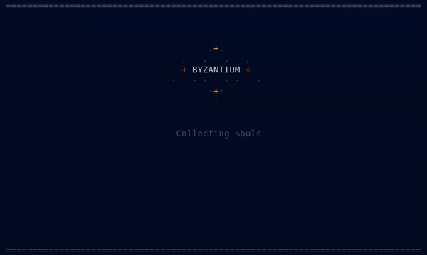

# ⚔️ Byzantium ⚔️

**Rebuild the fractured state after betrayal.**

---



> *What you’re seeing isn’t a representation of the system, it **is** the system.*

---

## 👑 What This Is 👑

Byzantium is a game built on a distributed state surface.

The system exists entirely on the board you’re looking at. There’s no hidden layer, no stored history, no backend keeping score. What you see is the system—continuously reshaped by the people inside it.

You don’t play *on* it. You play *with* it.

It’s like a group of people holding up a card table. As long as someone is still holding it, the table exists—and the game continues. Once everyone lets go, it disappears.

---

## 🔱 Equivocation 🔱

***Double spends don’t fracture Byzantium. They become part of the board.***

*Triple spends and larger forks collapse the same way: the state retains only a canonical pair, repairs the economic consequences, and burns the actor if the fork becomes insolvent.*

> **Check out what [**`🧠 Big Brain Brad`**](./B3Byzantium.md) thinks.**

---

## 🐧 Operating System Support

- ✅ Linux  
- ✅ macOS  
- ❌ Windows (sorry, but not sorry)

---

## 🍄 Install

To run Byzantium, install it with:

```bash
pipx install Byzantium-Game && Byzantium
```

You’ll need **Python 3.9 or newer** and an **80x24 UNIX-like terminal environment.**

> Don't have **pipx**? See how to install it [**`Here`**](../Relics/pipx.md).

---

## 🕸️ Networking

Byzantium runs in two modes.

**Siege** is local—multiple terminals on the same machine. *(sandbox)*  
**Campaign** runs across a LAN, allowing multiple machines to share the same **projection.**

>  *All nodes must use the same gateway (port), skeleton key, and number of souls to join the same projection. Default gateway: 9000*.  
>  *Tip: just spam Enter to drop straight into a board*.

---

## 🧩 Continuity

Leave and return *microseconds or millennia later*. As long as one participant still holds the state, the projection persists.

**You do not reconnect to the past. You reconnect to what is.**

---



> *This GIF is over 4x the size of the Byzantium runtime.*

---

## 🏛️ Architecture



> *The upper part of the stack runs on State, and the lower stack runs on Glyphs*

---

## 🗝️ Security Notice

Byzantium uses **Ed25519 signing** to validate actions.

However, networking currently relies on simple **XOR-based obfuscation**. This is not secure encryption—and it’s not meant to be.

The system prioritizes **state integrity over transport security**.

---



---

**Go Back to [**`Cerberus`**](../Cerberus/README.md) or Continue to [**`Mowsie`**](../Mowsie/README.md)...**

---

## 📜 License

See the [**`NOTICE`**](../NOTICE.md) for licensing information on the [**`Oblivious Compute`**](https://github.com/ObliviousCompute) project.

Use it, study it, modify it—just respect the terms outlined there.
