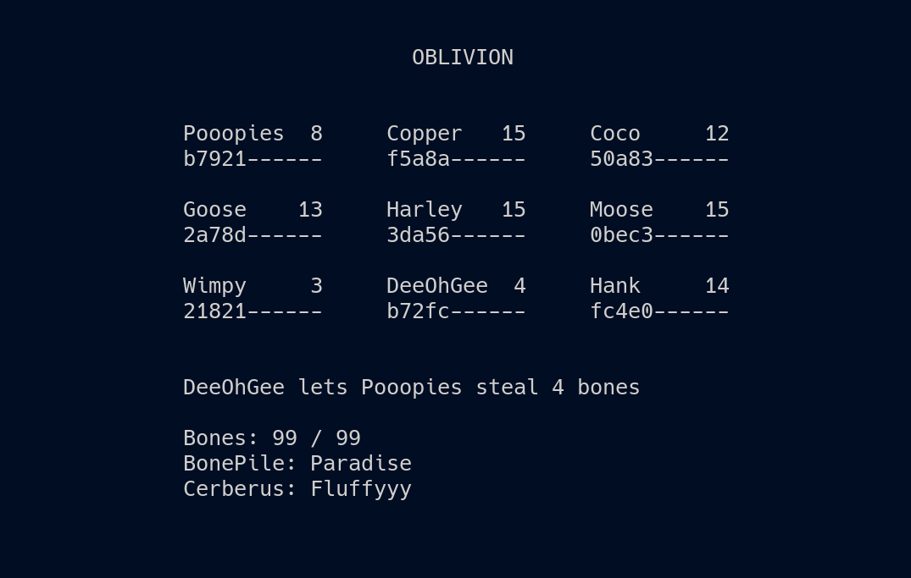

# 🔥 Cerberus 🔥

**Watch nine heads fight over a pile of bones.**

---



> ***Bare-Bones Oblivious State***

---

## 🦴 BonePile 🦴

Cerberus is an intentionally small experiment in **Byzantine-resistant distributed state**, built to be *read, run, and understood in one sitting*. Nine logical **Heads** fight over a single 99-bone **BonePile**, with every observer maintaining the complete state independently.

Cerberus is a distributed expression of an **Oblivious Compute** system: independently maintained states continuously project into a common medium and admit what survives the same rules. There is no replicated log and no authority deciding which story happened first.

**Make the dogs fight. Try to split the pile.**

---

## 🪝 ClawBack 🪝

Cerberus does not try to pretend equivocation never happened. When a Head signs conflicting actions, both can become consequential state.

If the equivocator can pay for both, both are honored. If it cannot, the fork becomes a debt. **ClawBack** pulls consequences through the BonePile until the equivocator can be convicted and an admissible state remains.

The trick is not choosing which lie was *“really first.”* It is making the consequences of both lies part of the computation.

**ClawBack turns equivocation into state.**

> **Check out what [**`🧠 Big Brain Brad`**](./B3Cerberus.md) thinks.**

---

## 🐧 Operating System Support

- ✅ Linux  
- ✅ macOS  
- ❌ Windows (sorry, but not sorry)

---

## 🍄 Install

To run Cerberus, install it with:

```bash
pipx install Cerberus-Game && Cerberus
```

You’ll need **Python 3.10 or newer** and an **80x24 UNIX-like terminal environment.**

> Don't have **pipx**? See how to install it [**`Here`**](../Relics/pipx.md).

---

## 🕸️ Networking

Cerberus runs locally over sockets as a **Sandbox Smoketest**.

> *All nodes must ***use the same Cerberus name and Head Count*** to join the same projection.*  
> ***Each node chooses its own DogTag and BonePile.***
> 
> *Tip: just spam Enter to drop straight into a board*.  

---

## 🧩 Continuity

Leave and return *microseconds or millennia later*. As long as one participant still holds the state, the projection persists.

**You do not reconnect to the past. You reconnect to what is.**

---

## 🏛️ Architecture


> *How Bones shape the BonePile*

The **Oblivious Medium** lets Cerberus produce unusually rich distributed behavior from a very small machine. Three layers are enough to carry identity, state, equivocation, recovery, projection, and re-entry.

*The whole thing runs in under 1,700 lines of Python.* **Small enough to understand as one object.**

---

## 🗝️ Security Notice

Cerberus uses **Ed25519 signing** to validate actions.

However, networking currently relies on simple **XOR-based obfuscation**. This is not secure encryption—and it’s not meant to be.

The system prioritizes **state integrity over transport security**.

---

**Go Back to [**`Cerberus`**](../Cerberus/README.md) or Continue to [**`Byzantium`**](../Byzantium/README.md)...**

---

## 📜 License

See the [**`NOTICE`**](../NOTICE.md) for licensing information on the [**`Oblivious Compute`**](https://github.com/ObliviousCompute) project.

Use it, study it, modify it—just respect the terms outlined there.


