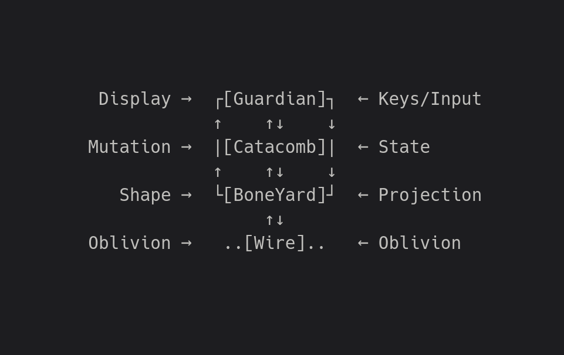

# 🔥 Cerberus 🔥

**Watch nine heads fight over a pile of bones.**

---

## 🐕🐕DogPile🐕🐕

Cerberus is a bare-bones experiment in Byzantine-resistant distributed state.

Nine logical **Heads** fight over a single 99-bone **BonePile**. Every observer maintains the complete state independently, with no replicated log and no authority deciding which story happened first.

When a Head signs conflicting actions, Cerberus does not necessarily choose one and discard the other. If both can be paid, both become consequential state. If they cannot, **Clawback** pulls the consequences apart until an admissible state remains.

Cerberus is a distributed expression of an **Oblivious Compute** system. The nodes do not maintain private histories of one another. They continuously project state into a common medium and admit what survives the same rules.

*Simply put, it's Byzantine agreement stripped down to the bare bones.*

**Make the dogs fight. Try to split the pile.**

---

## 🪝 ClawBack 🪝

Cerberus does not try to pretend equivocation never happened.

When a Head signs conflicting actions and cannot pay for both, the fork becomes a debt. Cerberus claws value back through the state until the equivocator can be convicted and an admissible BonePile remains.

The trick is not choosing which lie was “really first.” It is making the consequences of both lies part of the computation.

**Clawback turns equivocation into state.**

---

## 🐧 Operating System Support

- ✅ Linux  
- ✅ macOS  
- ❌ Windows (sorry, but not sorry)

---

## 🍄 Install

To run Byzantium, install it with:

```bash
pipx install Cerberus-Game && Cerberus
```

You’ll need **Python 3.9 or newer** and an **80x24 UNIX-like terminal environment.**

> Don't have **pipx**? See how to install it [**`Here`**](../Relics/pipx.md).

---

## 🕸️ Networking

Cerberus runs locally over sockets as a sandbox smoke test.

> *All nodes must use the same Cerberus name and Head Count to join the same projection.*
> *Each node chooses its own DogTag and BonePile.*
> *Tip: just spam Enter to drop straight into a board*.

---

## 🏛️ Architecture



> *How Bones shape the BonePile*

---
**Continue to [**`Byzantium`**](../Byzantium/README.md)...**

---

## 📜 License

See the [**`NOTICE`**](../NOTICE.md) for licensing information on the [**`Oblivious Compute`**](https://github.com/ObliviousCompute) project.

Use it, study it, modify it—just respect the terms outlined there.


