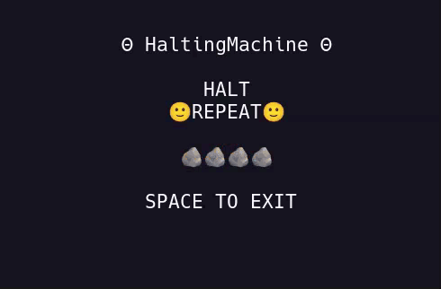

# 🙂 HaltingMachine 🙂

***Rock. Paper. Scissors. Rock. Paper. Scissors.***



> ***...Forever...and ever...***

---

## 🪞 House of Mirrors 🪞

HaltingMachine is a tiny executable specimen of Oblivious Compute.

Each terminal is an independent observer holding its own state. Normal observers move
through Rock → Paper → Scissors. An inverter moves through the same state space in
the opposite direction.

Nothing an observer projects becomes state merely because it was projected.
Every observer admits a projection only from its own present position.

The inverter can keep producing a continuation while the surrounding field remains
halted. It can also stop producing while the field continues to move it.

**Local execution does not decide the computation.**

---

## 🧠 Inside Out 🧠

The machine may remain a black box.

[**`The BlackBox`**](./BlackBox.md) asks what happens when computation is moved
outside the private execution of any individual machine and into the relation among
the states those machines independently project.

> *The box receives state. The box executes. The box projects state.*
>
> ***Then the computation begins.***

---

## 🐧 Operating System Support

- ✅ Linux  
- ✅ macOS  
- ❌ Windows (sorry, but not sorry)

---

## 🍄 Install

***To run HaltingMachine, install it with:***

```bash
pipx install HaltingMachine && HaltingMachine
```

You’ll need **Python 3.10+** and an **80x24 UNIX-like terminal environment.**

> Don't have **pipx**? See how to install it [**`Here`**](../Relics/pipx.md).

---

## 🕸️ Networking

**HaltingMachine runs locally** over sockets as a **Smoketest**.

---

**Reset the** [**`Spark`**](../Spark/README.md) **or go to** [**`The Beginning`**](https://github.com/ObliviousCompute)**...**

---

## 📜 License

See the [**`NOTICE`**](../NOTICE.md) for licensing information on the [**`Oblivious Compute`**](https://github.com/ObliviousCompute) project.

Use it, study it, modify it—just respect the terms outlined there.

