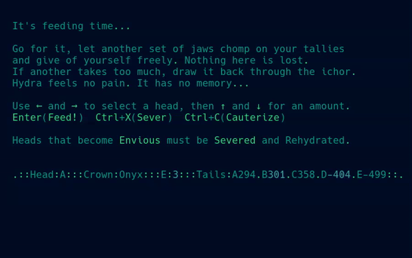
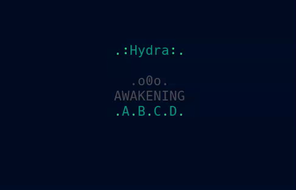

# 🐍 Hydra

Hydra is a distributed expression of the Oblivious Compute system. It is not a coordinated network, 
but a field of independent nodes sharing a single admissible state. Each node emits and each node observes, 
and what persists is simply what the network accepts. 

There is no leader and no history—only convergence.

---

---

## ⚙️ Running the Demo

---

### 🐧 Operating System

- ✅ Linux  
- ✅ macOS  
- ❌ Windows (not supported)

---

## 🎯 Intent

The Hydra Demo has been published as a **public technical disclosure**.

This demo exists to show that oblivious convergence through an admissability gate is possible.

If it fails, it fails cleanly.  
If it works, it demonstrates a new computational primitive.

---

## 📜 License

This project is released under the terms of the [`LICENSE`](../LICENSE).

Use it, study it, modify it—just respect the terms outlined there.

