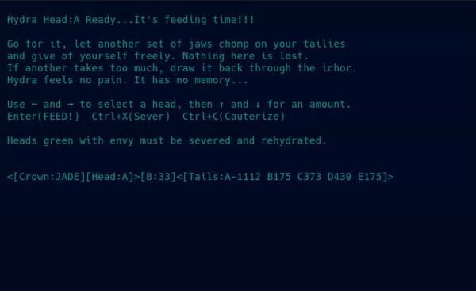

# 🐍 Hydra

Hydra is a distributed expression of the Oblivious Compute system. It is not a coordinated network, 
but a field of independent nodes sharing a single admissible state. Each node emits and each node observes, 
and what persists is simply what the network accepts. 

There is no leader and no history—only convergence.

---



---

## ⚙️ Running the Demo

Download the Hydra files into a single directory.

Open multiple terminal windows in that directory.
Each terminal represents a node.

Run Hydra in each terminal with a unique port and a shared peer set.

- Ports must be unique per machine  
- Ports may be the same across different machines  

Start with 3–5 nodes.

---

### 💻 Single Machine (Localhost)

#### Terminal 1 — Head A
```bash
python3 Hydra.py --id A --port 5001 --peers \
127.0.0.1:5002 127.0.0.1:5003 127.0.0.1:5004 127.0.0.1:5005
```

#### Terminal 2 — Head B
```bash
python3 Hydra.py --id B --port 5002 --peers \
127.0.0.1:5001 127.0.0.1:5003 127.0.0.1:5004 127.0.0.1:5005
```

#### Terminal 3 — Head C
```bash
python3 Hydra.py --id C --port 5003 --peers \
127.0.0.1:5001 127.0.0.1:5002 127.0.0.1:5004 127.0.0.1:5005
```

#### Terminal 4 — Head D
```bash
python3 Hydra.py --id D --port 5004 --peers \
127.0.0.1:5001 127.0.0.1:5002 127.0.0.1:5003 127.0.0.1:5005
```

#### Terminal 5 — Head E
```bash
python3 Hydra.py --id E --port 5005 --peers \
127.0.0.1:5001 127.0.0.1:5002 127.0.0.1:5003 127.0.0.1:5004
```

---

### 💻 Multiple Machines (LAN)

You may also run nodes across **multiple machines** by replacing `127.0.0.1`
with LAN IP addresses.

Each node binds to a local UDP port.  
Port numbers may be the **same across different machines**, but must be **unique per machine**.

Example:
- `192.168.1.101:5001`
- `192.168.1.102:5001`

These are distinct sockets and work correctly.

---

### 🐧 Operating System

- ✅ Linux  
- ✅ macOS  
- ❌ Windows (not supported)

---

## 🎯 Intent

The Hydra Demo has been published as a **public technical disclosure**.

This demo exists to show that oblivious convergence through an admissability gate is possible.

If it fails, it fails cleanly.  
If it works, it demonstrates a new computational primitive.


> Sniff.Snort..RAWR...bye

---

## 📜 License

This project is released under the terms of the [`LICENSE`](../LICENSE).

Use it, study it, modify it—just respect the terms outlined there.

