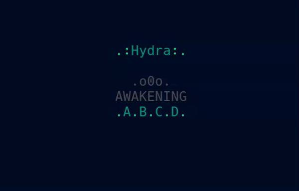
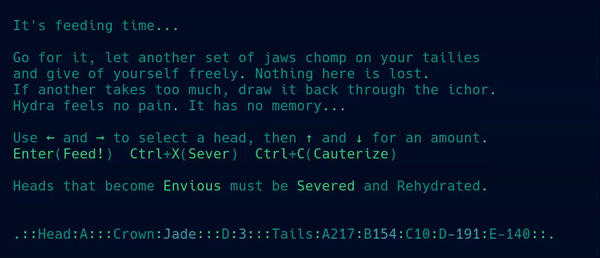

# 🐍🐍 Hydra 🐍🐍

**Watch packets collide as state flows.**

---



---

## 🪵 The Swamp Thing 🪵

In **Hydra**, the state is *fluid*. Nodes can leave, rejoin, and rehydrate instantly with almost no ceremony. Move between a **den** or a **swamp**, across machines or terminals.

As long as your **head is unique** and you share the same **depth**, your node will simply **snap to what is**. *What holds is what remains.*

**Hydra** is a distributed expression of an **Oblivious Compute** system. It is not a coordinated network, but a field produced among independent nodes maintaining compatible admissible states.

***Simply put, it's a distributed packet collider in under a thousand lines of code.***

**No leaders. Just convergence.**

$\Large \lbrace s\in\mathbb{Z}^n:\sum_i s_i=10n\rbrace$

---

## 🫧 Conservation 🫧

Hydra distributes conserved tallies across independently maintained nodes. The tallies may move, differ, and resolve, but **the conserved distribution is the computation.**

**Check out what [**`🧠 Big Brain Brad`**](./B3Hydra.md) thinks.**

---

## 🐧 Operating System Support

- ✅ Linux  
- ✅ macOS  
- ❌ Windows *(sorry, but not sorry)*

---

## 🍄 Install

To run Hydra, install it with:
```bash
pipx install Hydra-Game && Hydra  
```
You’ll need **Python 3.9 or newer** and an **80x24 UNIX-like terminal environment.**

> Don't have **pipx**? See how to install it [**`Here`**](../Relics/pipx.md).

---

## 🕸️ Networking

Hydra runs in two modes.

**Den** is local—multiple terminals on the same machine. *(sandbox)*  
**Swamp** runs across a LAN, allowing multiple machines to share the same field.

*All nodes must use the same depth (port), and the same number of mutated heads.*  

> *Run Hydra in a **Swamp** and see who can chomp the most Tailies.*

---

## 🧩 Continuity

Leave and return *microseconds or millennia later*. As long as one participant still holds the state, the projection persists.

**You do not reconnect to the past. You reconnect to what is.**

---


  
> *Think Hungry Hungry Hippos*  

---

## 🎯 Intent

The Hydra Demo has been published as a **public technical disclosure**.

*This demo exists to show that **oblivious convergence through positional admissibility** is possible.*

If it fails, it fails cleanly.  
If it works, this may demonstrate a **new computational primitive**.


---

**Continue to [**`Cerberus`**](../Cerberus/README.md)...**

---

## 📜 License

See the [**`NOTICE`**](../NOTICE.md) for licensing information on the [**`Oblivious Compute`**](https://github.com/ObliviousCompute) project.

Use it, study it, modify it—just respect the terms outlined there.
