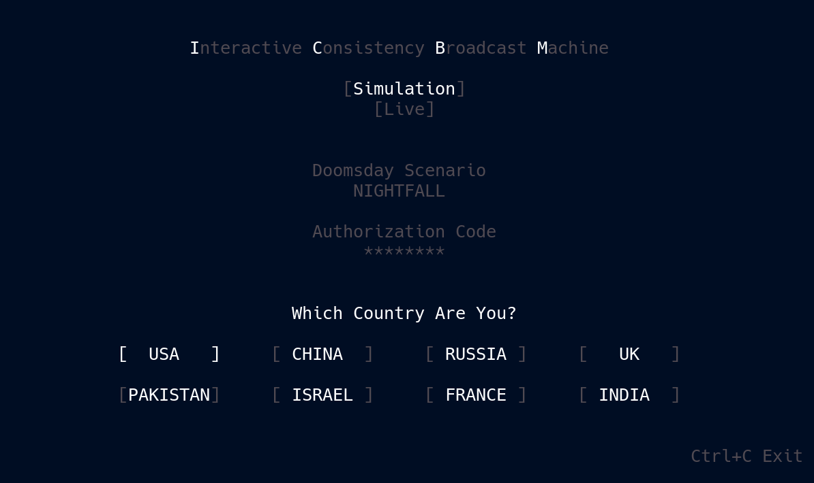

# 🚀 ICBM 🚀

***Interactive Consistency Broadcast Machine***

---



> ***Fission is 777 lines total. Fewer than 400 lines of distributed machinery.***

---

## ☢️ Don’t Do It ☢️

ICBM is a deliberately small implementation of Interactive Consistency. Five independent observers form a common **Set**, each committing an Authorization Code into the same Genesis. Once the Set exists, **State** payloads continuously project the machine’s current condition through an oblivious medium. During the countdown, a **Key** payload presents a candidate authorization, and every observer applies the same admissibility rule against the commitments already present in the field.

Every admitted Key changes the computation itself. One abort is a state. Two aborts is another. Four valid authorizations resolve the field to **LAUNCH ABORTED**; if the clock reaches zero first, it resolves to **LAUNCH SUCCESSFUL**. There is no leader, coordinator, replicated log, or privileged observer computing the answer. Each observer maintains its own state, and the symmetry between those states is the computational object.

***Five observers. One field. Ten seconds. Don’t do it.***

> **Genesis is the boot sequence.** Before Genesis settles, ICBM is forming the common state that defines the machine. ***Once Genesis exists, the distributed computer is running.***
>
> **The countdown is gameplay pressure, not part of the consistency mechanism. Failing to enter a valid authorization in time is losing the game, not a Byzantine violation.**  
>
> ***If you think you have a counterexample, reproduce it through the running program and show loyal observers resolving the computation differently.***

---

## 🐧 Operating System Support

- ✅ Linux  
- ✅ macOS  
- ❌ Windows (sorry, but not sorry)

---

## 🍄 Install

***To run ICBM, install it with:***

```bash
pipx install ICBM-Game && ICBM
```

You’ll need **Python 3.10 or newer** and an **80x24 UNIX-like terminal environment.**

> Don't have **pipx**? See how to install it [**`Here`**](../../Relics/pipx.md).

---

## 🕸️ Networking

**ICBM runs in two modes**

**Simulation** is a local five-terminal smoke test over loopback sockets.

**Live** runs across a LAN with multiple machines.

> *All nodes must ***enter the same Doomsday Scenario*** to join the same genesis.*  

---

## 🗝️ Security Notice

> Oblivious Compute does not depend on any particular encryption scheme. Some reference implementations use simple XOR obfuscation for projection separation, which is not secure encryption and is not intended to be. Add whatever transport security you want; it does not change the primitive.

---

**Continue the** [**`Spark`**](../../Spark/README.md)**`⟶`**[**`Correspondence`**](../../Correspondence.md)

---

## 📜 License

See the [**`NOTICE`**](../../NOTICE.md) for licensing information on the [**`Oblivious Compute`**](https://github.com/ObliviousCompute) project.

Use it, study it, modify it—just respect the terms outlined there.
